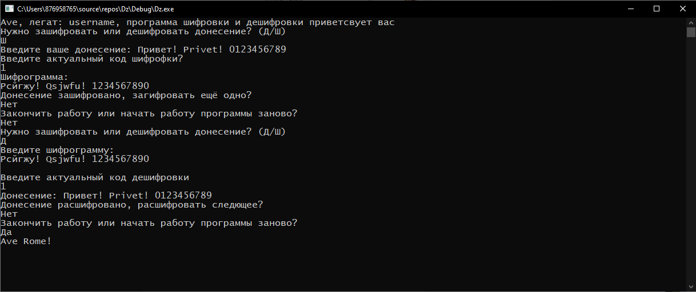

# Cesar_code_and_decode: краткая характеристика
**Cesar_code_and_decode**: Консольная приложение, написанное на языке с++, для шифровки и
дешифровки, использущая возможность языка конвертировать переменные char в int и обратно.
На данный момент программа поддерживает ввод на английском и русском языках.

# Как оно выглядит на практике

# Инструкция по использованию
1. Программа запускается в редакторе кода, поддеживающем код на С++ (Пердпочтительно Visual Studio)
2. В свойствах проекта следует отключить проверки SDL (Свойства проекта С/С++ -> Общее -> проверки sdl). Данная мера является защитой от захвата и попыток разбора вражеских агентов.
3. После запуска программы она попросит выбрать режим работы в дешифрование и шифрования.
4. В обоих режимах необходимо ввести сообщения и написать шаг шифрования (Целое не отрицательное число, меньшее мощности используемого алфавита (Ну если что программа сама подправит)).
5. Программа предложит оброботать ещё сообщение.
6. При отказе программа предложит завершить работу или начать работу с шага 3.

Примечаение 1: кодом шифрофки в рограмме - является не отрицательное число, на которое сдвигается символ в алфавите.
Примечание 2: программа также имеет продвинутую возможность шифрофки через дешифровку, и дешифровки через шифрофку
